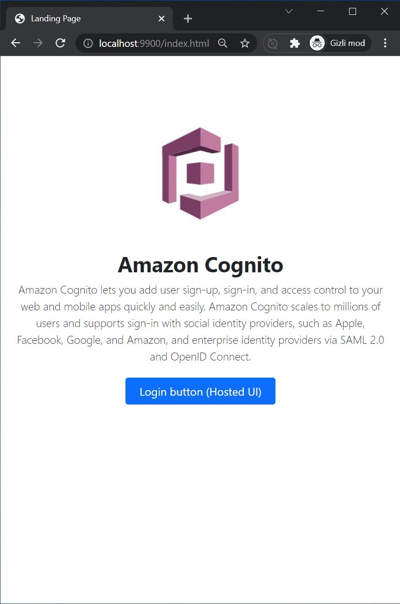
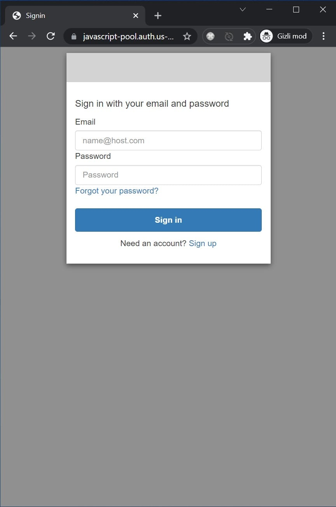
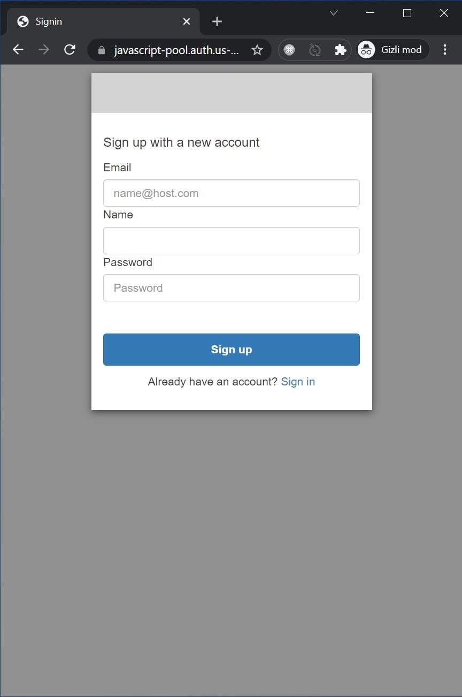
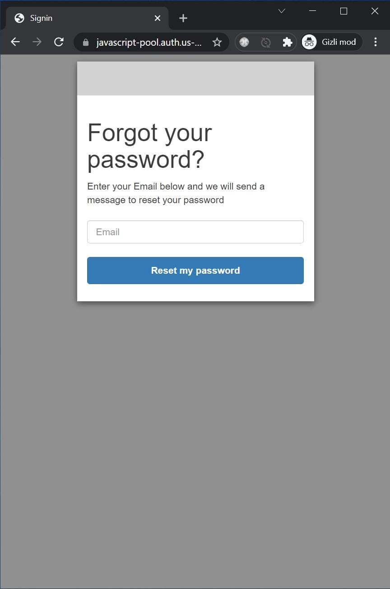
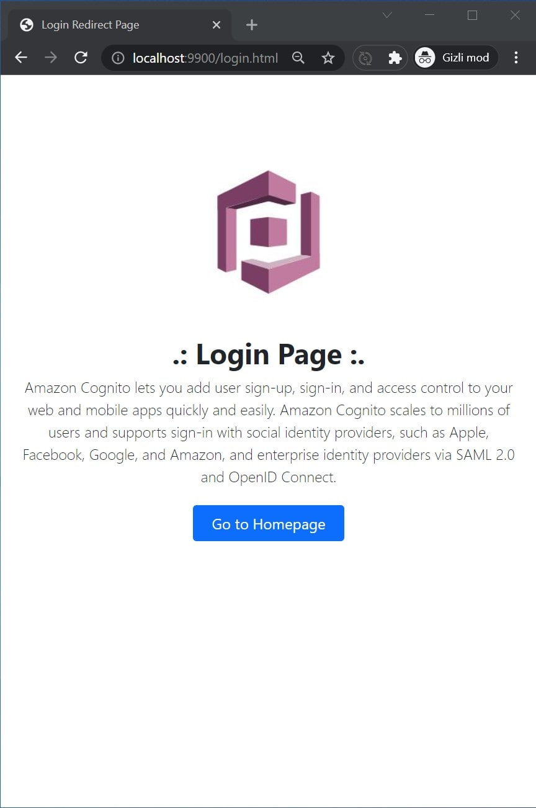
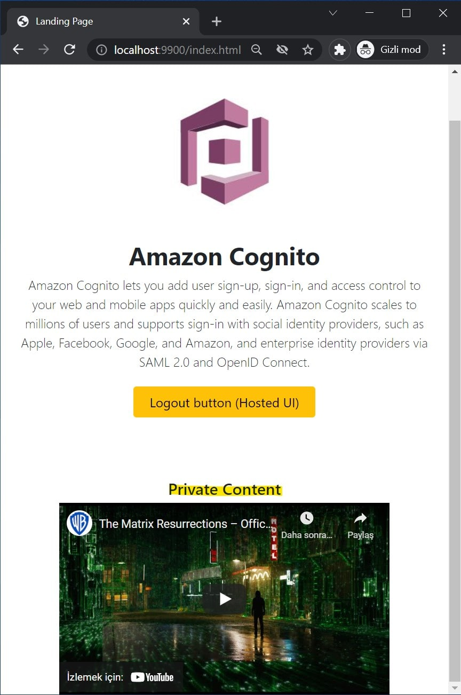
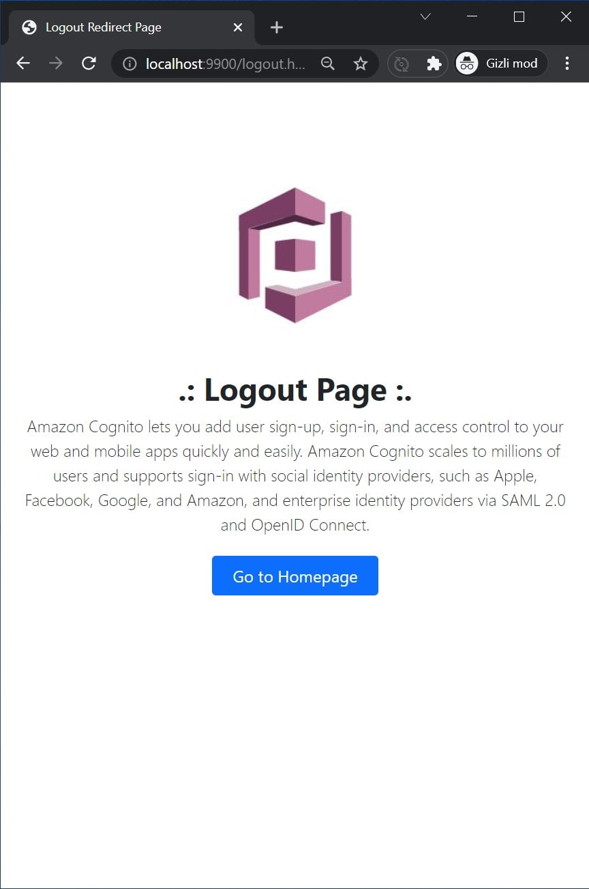

# AWS Cognito Hosted UI Python 3 Sample App

- Landing page
- AWS Cognito Hosted UI

## Installation

    mkdir aws-cognito-hosted-ui-python-sample-app
    cd aws-cognito-hosted-ui-python-sample-app
    git clone git@github.com:mahmutbayri/aws-cognito-hosted-ui-python-sample-app.git .
    cp .env.example .env
    python3 -m venv venv
    . venv/bin/activate
    pip install -r requirements.txt
    # edit your .env file, and difine CLIENT_ID, USERPOOL_ID, DOMAIN

## Deactivate activated environment

    deactivate

## Test server

    PORT=9900 python3 index.py

http://localhost:9900

## Screenshots

### Landing page

### Amazon Cognito Hosted UI - Login page

### Amazon Cognito Hosted UI - Sign up page

### Amazon Cognito Hosted UI - Forgot password page

### Amazon Cognito Hosted UI - Redirect page

### Landing page with a private content

### Logout redirect page

